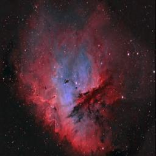

# APOD_Scraping

Simple Python script to get the Nasa Astronomy Picture Of the Day dataset (APOD) downloaded on your computer in a given repository, get your API personal key on the 
https://api.nasa.gov website, enter it in the script, adjust the date of end and start, (it's set on the first day and the actual day by default) and then run, the name of the image will be a basic iterated id, their dimensions will be adjusted to 256x256 (although you can modify it), and every image will be converted to jpeg.

A csv file will also be created, in which will be stored the date of the picture, its id and its title.

Could be used for machine learning and computer vision.
